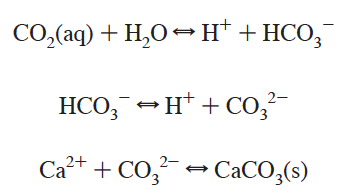

### Marine CO2 system
The marine inorganic carbon or marine CO2 system is valuable to study for a variety of reasons. From a purely chemical standpoint, CO2 (carbon dioxide) in the air can react with H2O molecules in the ocean to form H2CO3 (carbonic acid). As a diprotic acid, carbonic acid can lose one H+ (or proton) to form HCO3- (bicarbonate) and a second to form CO32- (carbonate). The equilibria involved, seen in the snapshot below from [Millero (2007) _The Marine Inorganic Carbon Cycle_](https://pubs.acs.org/doi/abs/10.1021/cr0503557), are governed by acid dissociation constants (ka values) which are dependent on temperature, pressure, and salinity.

### Humans and marine inorganic carbon
Moreover, we've been able to measure atmospheric carbon dioxide with remarkably high precision and accuracy since the late 1950s thanks to the pioneering work of Charles David Keeling at Scripps Institution of Oceanography, UC San Diego: [https://scripps.ucsd.edu/programs/keelingcurve/](https://scripps.ucsd.edu/programs/keelingcurve/). And we've been tracking the concomitant increase in marine inorganic carbon for several decades as well (see [Bates _et al._ (2014) _A time-series view of changing ocean chemistry due to ocean uptake of anthropogenic CO2 and ocean acidification](https://tos.org/oceanography/article/a-time-series-view-of-changing-ocean-chemistry-due-to-ocean-uptake-ofanthro) for more details). We know that the ocean is taking up a substantial percentage of the CO2 pollution that humans are generating which, in turn, makes the ocean more acidic (related to the equations above).

### Who cares?
A scientifically fascinating side effect of the ocean acidification phenomenon is that, due to the acid dissociation constants (ka values) for carbonic acid and bicarbonate ion, at current ocean conditions, bicarbonate ion is the favored form of marine inorganic carbon. And, unfortunately, as ocean pH decreases from its current surface average of ~ 8.1, bicarbonate becomes more and more favored while carbonate becomes less and less favored. And carbonate, as scientists understand it, is the ion that is used in the building blocks of marine calcifiers' shells (like corals, mollusks, and pteropods (AKA sea butterflies), to name a few).

The following interactive graph shows the concentrations of carbonic acid, bicarbonate ion, and carbonate ion as functions of pH when total dissolved inorganic carbon (the sum of all of those species) is equal to 2,200 &mu;mol/kg (a reasonable surface ocean value based on the paper by Bates _et al._ mentioned above). You can zoom into both x- and y-axes to see finer detail and drag the cursor over to see the concentrations of the different species across a wide range of pH.

    <iframe class="resp-iframe" src="../interactive-pages/marine-co2-equil.html"></iframe>

### Investigations
1. Drag your cursor to a pH of 8.1 (the current average pH of our surface ocean).  What do you notice about the concentration of the various ions?

2. In general, calcifying organisms need carbonate ions to produce shells (Ca2++CO32+ = CaCO3). What trends in pH, relative to current conditions, are favorable for calcifying organisms? Explain using the graph animation.

3. Immediately prior to the industrial revolution, average surface ocean pH was 8.2. Although this is only a decrease of 0.1 on the pH scale, why might it have a large impact on calcifying organisms? To answer this better, compare the concentration of the ions when the pH is 8.2 compared to 8.1.

4. The graph above is based on a "static" or unchanging value of total dissolved inorganic carbon. However, we know that total dissolved inorganic carbon concentrations are increasing globally due to the influx of anthropogenic/human-made CO2. How do you think the lines on this graph might change as total dissolved inorganic carbon concentrations continue to rise? Do you think all of the lines will change in the same way?

### Additional Resources and Acknowledgments
To see the equations I used to generate the graph above, you can visit my Jupyter Notebook with the associated code [here](https://github.com/SUPScientist/Website-Analysis/blob/master/Teaching-Resources/Marine%20CO2%20Equilibria%2C%20Static.ipynb).

The work here was done in collaboration with Rachel Stein and Tera Black of the California Science Teachers Association and the 2018 California Science Education Conference Climate Summit Cadre. We are producing a short course to present at the California Science Education Conference Climate Summit in Nov/Dec of 2018. I will post the materials for the short course here when we finalize them.
